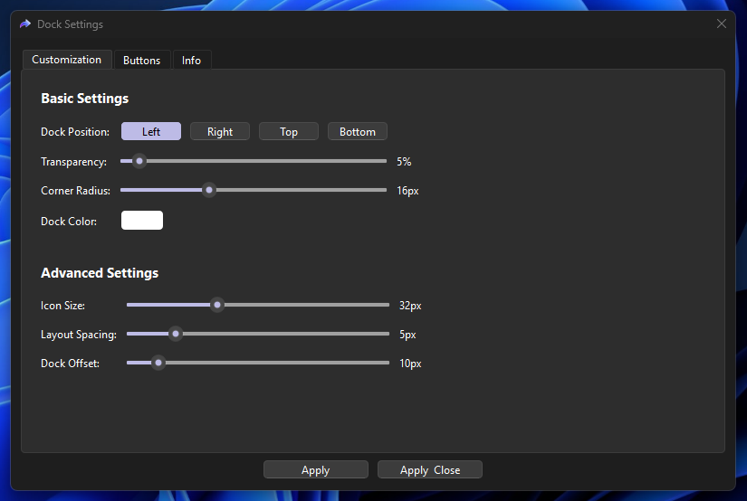

# Dynamic Dock Widget

A customizable, auto-hiding dock widget built with PyQt6. It provides a sleek, modern, and highly configurable interface for your desktop to launch your favorite applications and tools with style!

## Features

- 🔄 Auto-hiding dock with smooth animations
- 📍 Multiple dock positions (Left, Right, Top, Bottom)
- ⚙️ **Advanced GUI-based Settings:**
  - Tabbed interface for easy navigation ("Customization", "Buttons", and "Info").
  - **Full Button Management:** Add, edit, delete, and reorder buttons directly from the settings dialog.
  - **Live Previews:** See your changes applied instantly.
- 🎨 Customizable appearance:
  - Adjustable transparency
  - Custom color picker
  - Adjustable corner radius
  - Configurable icon size
  - Adjustable layout spacing between icons
  - Adjustable dock offset from the screen edge
- 🚀 Dynamic button loading and management
- 🖼️ Custom icon support for buttons
- 💫 Tooltips for buttons
- ⚙️ Persistent settings stored in JSON

## Requirements

- Python 3.6+
- PyQt6

## Installation

1. Ensure you have Python installed
2. Install the required dependency:
```bash
pip install PyQt6
```

## Usage

Run the dock application:
```bash
python dock.py
```

### Controls

- Hover over the screen edge to reveal the dock
- Click buttons to launch applications or execute commands
- Click the ⚙️ (gear) icon to open settings
- Use the settings dialog to customize:
  - Dock position on screen
  - Background transparency
  - Dock color
  - Icon size
  - Layout spacing
  - Dock offset from screen edge

### Button Configuration

Configure buttons using GUI elements via settings options in buttons tab.
Each button supports:
- `name`: Display name (shown in tooltip)
- `icon`: Path to PNG icon file
- `action`: Command to execute when clicked

### Settings

All settings are automatically saved and persisted between sessions:
- `settings.json`: Stores dock position, appearance, and size
- `buttons.json`: Stores button configurations
- Default configurations are created on first run

## Screenshots

Get a glimpse of the Dynamic Dock Widget in action!

### Dock in action


### Settings Dialog


## Development

The dock is designed to be extensible. The main components are:
- `DockWindow`: Main dock widget with auto-hide functionality
- `DockButton`: Custom button implementation with animations
- `SettingsDialog`: Configuration interface
- Settings persistence layer with JSON storage

## License

MIT License